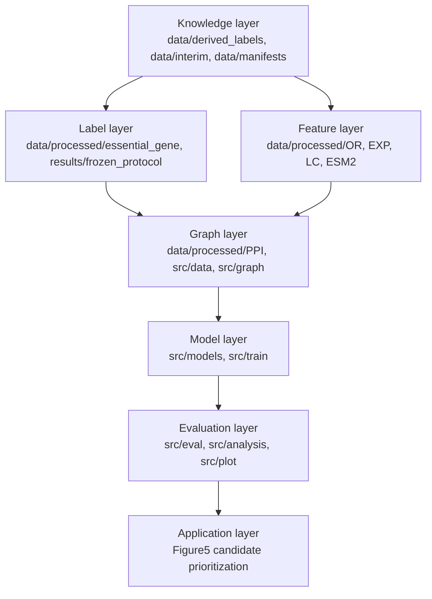
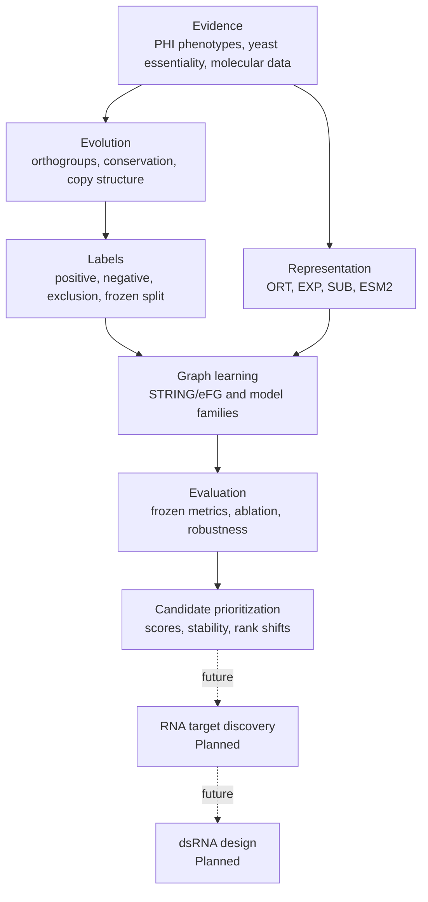
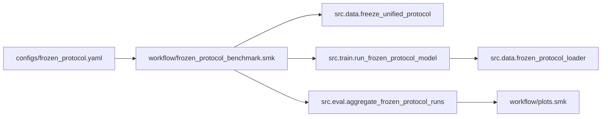

# EvoGATE architecture

_Code architecture, scientific architecture, module boundaries, and execution relationships._

---

## Seven-layer code architecture

| Layer | Responsibility | Main paths | Canonical entry |
|---|---|---|---|
| Knowledge | Evidence, species scope, transfer artifacts, ID provenance | `data/derived_labels/`, `data/interim/`, `data/manifests/` | `src.data.build_fgraminearum_newlabel_bridge` |
| Label | Positive/negative regimes and frozen splits | `data/processed/essential_gene/`, `results/frozen_protocol/` | `workflow/fgraminearum_label_materialization.smk`, `src.data.freeze_unified_protocol` |
| Feature | ORT, EXP, SUB, ESM2 feature blocks | `data/processed/OR/`, `data/processed/EXP/`, `data/processed/LC/`, `data/processed/ESM2/`, `src/features/` | Modality-specific builders; no unified feature workflow |
| Graph | PPI filtering, node universe, edge index, topology embeddings | `data/processed/PPI/`, `src/data/frozen_protocol_loader.py`, `src/graph/` | `src.data.frozen_protocol_loader` |
| Model | Classical, topology, GNN, and fusion models | `src/models/`, `src/train/` | `src.train.run_frozen_protocol_model` |
| Evaluation | Metrics, aggregation, ablation, interpretation, plots | `src/eval/`, `src/analysis/`, `src/plot/`, `workflow/` | Figure workflows and evaluation modules |
| Application | Candidate ranking and future target discovery | `src/eval/build_figure5_candidate_prioritization.py`, `results/Figure5*` | Candidate module; RNA layer is Planned |

## Scientific architecture

| Scientific stage | Status |
|---|---|
| Evidence assembly | Partially implemented |
| Evolutionary transfer artifact | Partially implemented |
| Label materialization | Validated |
| Multimodal representation | Validated |
| Graph learning | Validated |
| Evaluation | Partially validated |
| Candidate prioritization | Partially implemented |
| RNA target discovery | Planned |
| dsRNA design | Planned |

## Main execution chain

## Configuration model

`configs/frozen_protocol.yaml` defines repository-relative data roots, protocol names, frozen runtime settings, feature roots, ESM2 caches, label sources, model families, and model hyperparameters. Figure-specific YAML files reference this base configuration and override experiment scope or model variants.

Resolved runtime configurations are expected in per-run output directories. Current `results/Figure3*/runtime/` artifacts preserve some rendered configs, but the primary `outputs/` tree is missing from this workspace.

## Data and identifier contracts

The primary Fusarium canonical identifier is `fgraminearum::FGRAMPH1_*`; graph-facing files may use the prefix-stripped `FGRAMPH1_*` value. `frozen_protocol_loader.py` joins labels, graph nodes, feature rows, and ESM2 keys through explicit graph and canonical identifiers.

The loader constructs a node universe from the union of graph and labeled nodes, maps the frozen split to node indices, normalizes numeric features using training nodes, and returns a single bundle consumed by model families.

## Model and output contracts

A standard run writes `predictions.tsv`, `metrics.tsv`, `feature_schema.tsv`, `edge_table.tsv`, `split_manifest.tsv`, `resolved_config.yaml`, and model-specific artifacts such as `best_model.pt`, `model.pkl`, `training_log.tsv`, or ESM2 alignment audits.

The current workspace contains aggregated results and Figures but lacks the main `outputs/` tree. Consequently, this output contract is **Implemented** in code but **Blocked** for complete local reconstruction.

## Legacy boundaries

- `docs/epgat_migration/` records EPGAT migration history
- `docs/protocol_refactor/` records ProGATE_v2 protocol refactoring
- several `scripts/run_*.sh` files hard-code the historical ProGATE_v2 path
- legacy training and data adapters remain under `src/` for controlled replay
- historical artifacts must not be treated as current canonical entry points unless explicitly named in this document

See [MIGRATION_GUIDE.md](MIGRATION_GUIDE.md) for the non-destructive migration policy.

## Dependencies and portability

The code imports Python, pandas, NumPy, PyYAML, scikit-learn, PyTorch, graph libraries, Snakemake, R, and plotting packages. No authoritative environment lock exists. Some configured Python and cache paths are machine-specific. Dependency and hardware reproducibility are therefore **Blocked** at release grade.
