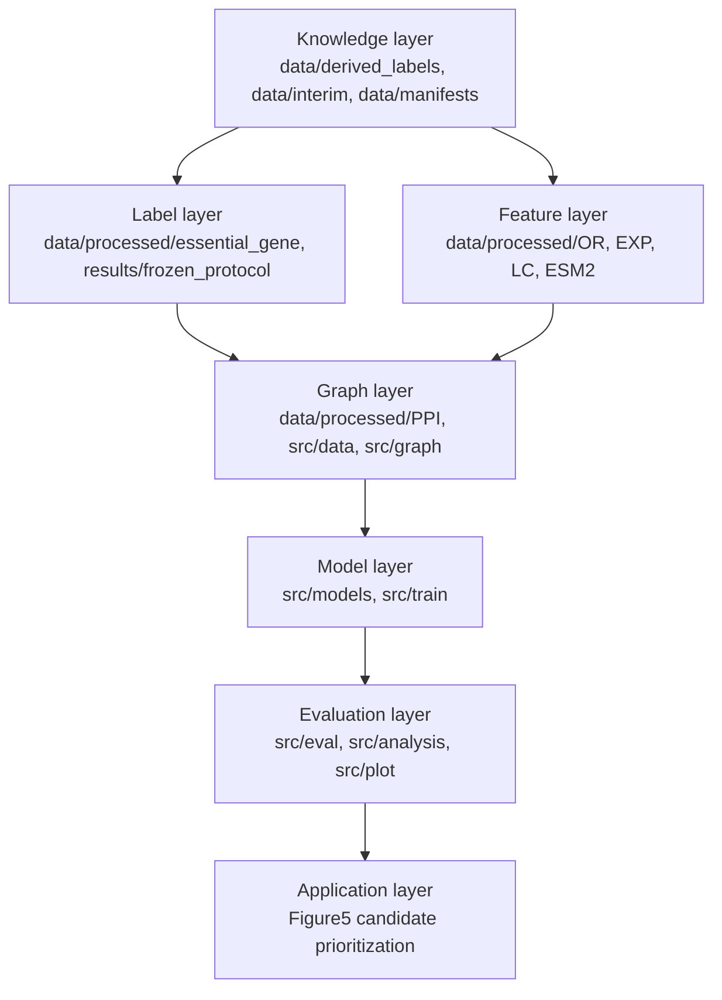
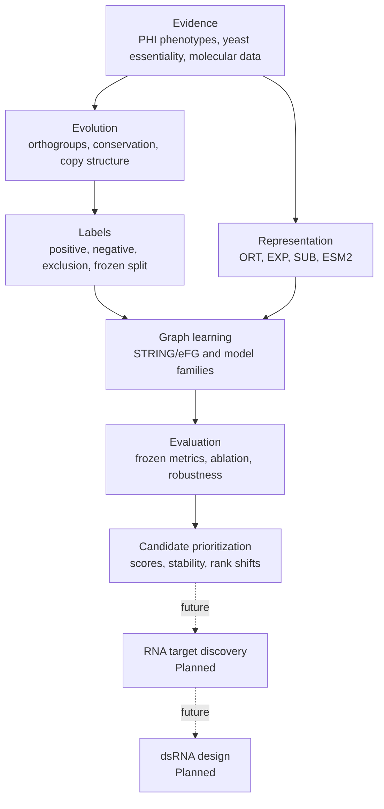
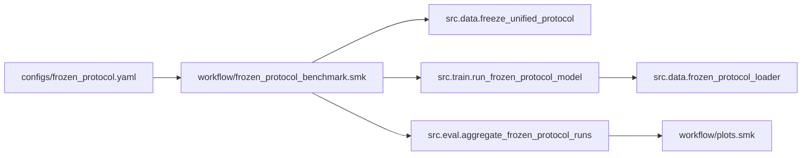

# EvoGATE 架构

_代码架构、科学架构、模块边界与执行关系。_

---

## 七层代码架构

| 层 | 职责 | 主要路径 | 规范入口 |
|---|---|---|---|
| Knowledge | Evidence、species scope、transfer artifact 和 ID provenance | `data/derived_labels/`、`data/interim/`、`data/manifests/` | `src.data.build_fgraminearum_newlabel_bridge` |
| Label | Positive/negative regime 和 frozen split | `data/processed/essential_gene/`、`results/frozen_protocol/` | `workflow/fgraminearum_label_materialization.smk`、`src.data.freeze_unified_protocol` |
| Feature | ORT、EXP、SUB、ESM2 feature block | `data/processed/OR/`、`data/processed/EXP/`、`data/processed/LC/`、`data/processed/ESM2/`、`src/features/` | 各模态 builder；无统一 feature workflow |
| Graph | PPI filtering、node universe、edge index、topology embedding | `data/processed/PPI/`、`src/data/frozen_protocol_loader.py`、`src/graph/` | `src.data.frozen_protocol_loader` |
| Model | Classical、topology、GNN 与 fusion model | `src/models/`、`src/train/` | `src.train.run_frozen_protocol_model` |
| Evaluation | Metric、aggregation、ablation、interpretation、plot | `src/eval/`、`src/analysis/`、`src/plot/`、`workflow/` | Figure workflow 与 evaluation module |
| Application | Candidate ranking 与未来 target discovery | `src/eval/build_figure5_candidate_prioritization.py`、`results/Figure5*` | Candidate module；RNA layer 为 Planned |

## 科学架构

| 科学阶段 | 状态 |
|---|---|
| Evidence assembly | Partially implemented |
| Evolutionary transfer artifact | Partially implemented |
| Label materialization | Validated |
| Multimodal representation | Validated |
| Graph learning | Validated |
| Evaluation | Partially validated |
| Candidate prioritization | Partially implemented |
| RNA target discovery | Planned |
| dsRNA design | Planned |

## 主要执行链

## 配置模型

`configs/frozen_protocol.yaml` 定义 repository-relative data root、protocol name、frozen runtime setting、feature root、ESM2 cache、label source、model family 和 hyperparameter。Figure-specific YAML 引用该 base config，并覆盖实验范围或模型 variant。

Per-run output directory 应保存 resolved runtime config。当前 `results/Figure3*/runtime/` 保留了部分 rendered config，但主要 `outputs/` tree 在本工作区缺失。

## 数据与 ID contract

Fusarium 主 canonical identifier 为 `fgraminearum::FGRAMPH1_*`；graph-facing file 可使用去掉前缀的 `FGRAMPH1_*`。`frozen_protocol_loader.py` 通过明确的 graph/canonical ID 连接 label、graph node、feature row 和 ESM2 key。

Loader 从 graph node 与 labeled node 的并集构建 node universe，将 frozen split 映射到 node index，使用 training node 归一化 numeric feature，并返回供所有 model family 消费的统一 bundle。

## 模型与输出 contract

标准运行写出 `predictions.tsv`、`metrics.tsv`、`feature_schema.tsv`、`edge_table.tsv`、`split_manifest.tsv`、`resolved_config.yaml`，以及 `best_model.pt`、`model.pkl`、`training_log.tsv` 或 ESM2 alignment audit 等 model-specific artifact。

当前工作区包含 aggregated result 与 Figure，但缺少主要 `outputs/` tree。因此 output contract 在代码中为 **Implemented**，但完整本地重建为 **Blocked**。

## 遗留边界

- `docs/epgat_migration/` 记录 EPGAT migration history
- `docs/protocol_refactor/` 记录 ProGATE_v2 protocol refactoring
- 若干 `scripts/run_*.sh` 硬编码历史 ProGATE_v2 path
- `src/` 中保留 legacy training/data adapter，用于 controlled replay
- 除非本文明确指定，historical artifact 不得作为当前 canonical entry point

非破坏性迁移策略见 [MIGRATION_GUIDE.zh-CN.md](MIGRATION_GUIDE.zh-CN.md)。

## 依赖与可移植性

代码 import Python、pandas、NumPy、PyYAML、scikit-learn、PyTorch、graph library、Snakemake、R 和 plotting package。当前没有 authoritative environment lock，部分 Python/cache path 绑定具体机器，因此 dependency 与 hardware 的发布级复现为 **Blocked**。
