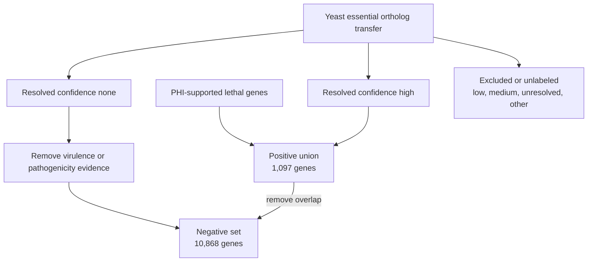

# EvoGATE data flow

_Traceable flow from external evidence through labels, model evaluation, Figures, and candidate ranking._

---

## End-to-end flow

```mermaid
flowchart LR
    accTitle: EvoGATE end-to-end data flow
    accDescr: External evidence is bridged into canonical genes, materialized as frozen labels, combined with multimodal graph features, evaluated across seeds, and summarized into Figures and candidate rankings.

    external_evidence["External evidence<br/>PHI, yeast essentiality, PPI, omics"]
    id_bridge["Canonical ID bridge<br/>XP and legacy IDs to FGRAMPH1"]
    label_materialization["Label materialization<br/>positive and negative regimes"]
    exclusion["Exclusion<br/>virulence, uncertain, unresolved"]
    frozen_split["Frozen split<br/>70/10/20"]
    multimodal_features["Multimodal features<br/>ORT, EXP, SUB, ESM2"]
    graph["Graph<br/>STRING/eFG PPI"]
    training["Training<br/>five seeds and model families"]
    aggregation["Aggregation<br/>AUPRC, MCC, AUROC"]
    figures["Figures<br/>results/Figure*"]
    candidate_ranking["Candidate ranking<br/>scores and rank shifts"]

    external_evidence --> id_bridge --> label_materialization
    label_materialization --> exclusion --> frozen_split
    external_evidence --> multimodal_features
    frozen_split --> training
    multimodal_features --> training
    graph --> training --> aggregation --> figures --> candidate_ranking
```

## Stage contracts

| Stage | Input | Output | Key identifier | Script or module | Configuration | Status |
|---|---|---|---|---|---|---|
| External evidence | PHI evidence mirror, yeast transfer table, molecular sources | Repository-local evidence and modality files | Source-specific IDs | Modality-specific builders | Multiple historical sources | Partially implemented |
| Canonical ID bridge | XP proteins, legacy maps, unified map, modality mappings | `protein_to_canonical_bridge.tsv` | `source_protein_id`, `resolved_canonical_gene_id` | `src.data.build_fgraminearum_newlabel_bridge` | `configs/fgraminearum_label_materialization.yaml` | Validated |
| Label materialization | Lethal list, transfer candidates, evidence exclusions | `positive_genes.tsv`, `negative_genes.tsv`, `labels.tsv` | `canonical_gene_id` | `src.data.materialize_fgraminearum_label_regimes` | Label materialization config | Validated |
| Exclusion | `none` confidence pool, virulence/pathogenicity evidence, mapping status | Filtered negative set; audit columns | `canonical_gene_id` | Source preparation and materialization modules | Label materialization config | Partially implemented |
| Frozen split | Materialized labels | `results/frozen_protocol/splits/*.tsv` | `graph_gene_id` | `src.data.freeze_unified_protocol` | `configs/frozen_protocol.yaml` | Validated |
| ORT | InParanoid-derived orthology matrices | `data/processed/OR/<species>/orthologs.csv` | `Gene` / normalized graph ID | `src.data.build_inparanoid_ortholog_matrix` | Hard-coded historical paths in builder | Partially reproducible |
| EXP | GEO/GTEx-derived expression inputs | `data/processed/EXP/<species>/profile.csv` | `Gene` / normalized graph ID | `src.data.build_expression_profile_csv` | Builder-local paths | Partially reproducible |
| SUB | COMPARTMENTS/eFG localization evidence | `data/processed/LC/<species>/subloc.csv` | `Gene` / normalized graph ID | `src.data.build_subloc_csv_from_compartments` | Builder-local paths | Partially reproducible |
| ESM2 | Species protein FASTA | `data/processed/ESM2/<species>/esm2_pooled.pt` | Protein/gene embedding key | `src.features.extract_esm2_pooled` | `configs/prepare_esm2_cache.yaml`, frozen config | Implemented |
| Graph | STRING/eFG interaction files | Filtered `edge_table.tsv`, in-memory edge index | `A`, `B` | `src.data.frozen_protocol_loader` | `configs/frozen_protocol.yaml` | Validated |
| Training | Frozen bundle, model config, seed | Per-run predictions, metrics, model artifacts | `graph_gene_id`, `seed` | `src.train.run_frozen_protocol_model` | Frozen and Figure configs | Implemented |
| Aggregation | Per-run `metrics.tsv` | Aggregated and publication summaries | protocol/model/feature/seed | `src.eval.aggregate_frozen_protocol_runs` | Workflow arguments | Implemented |
| Figure | Summaries, predictions, feature schemas | `results/Figure*/` tables and plots | Figure-specific | `src/eval/`, `src/analysis/`, `src/plot/` | Figure workflows/configs | Partially reproducible |
| Candidate ranking | Figure3a predictions across features and seeds | Candidate rank and ESM2-rescue tables | `gene_id` | `src.eval.build_figure5_candidate_prioritization` | CLI arguments | Blocked by missing `outputs/` |

## Label flow details



The upstream assignment of `weak_positive_confidence` is **Unknown** because its generator is not present. The diagram documents how the existing field is consumed, not how it was originally calculated.

## Model flow details

The loader reads frozen labels and splits, creates the graph node universe, joins selected feature tables, aligns ESM2 embeddings, computes training-only normalization, and exposes train/validation/test indices. Model selection during neural training uses validation AUPRC when available. Standard predictions use threshold `0.5`; threshold-tuned analyses must derive thresholds from validation data.

## Result and Figure flow

Per-run artifacts are expected under `outputs/<experiment>/<protocol>/<model>/<feature>/run_<seed>/`. Aggregators write summary tables under `results/`. Figure workflows consume either per-run outputs or existing summaries and write data, plots, and reports to `results/Figure*`.

Because `outputs/` is absent in this workspace, some result-to-run links cannot currently be followed. Existing results are retained evidence, but not all are locally rebuildable.

## Provenance requirements

Every new artifact should record its input paths, producing module, resolved configuration, protocol version, split version, seed, identifier namespace, and checksum where feasible. Silent row dropping, silent identifier conversion, and implicit label fallback are prohibited.

