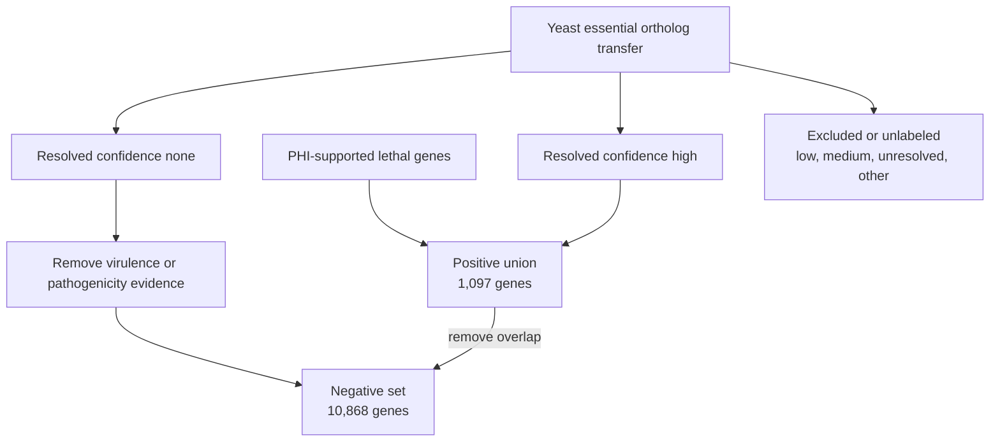

# EvoGATE 数据流

_从外部证据到标签、模型评价、Figure 和候选排序的可追溯数据流。_

---

## 端到端数据流

```mermaid
flowchart LR
    accTitle: EvoGATE end-to-end data flow
    accDescr: 外部证据先映射到 canonical gene，再物化为 frozen label，与多模态图特征结合，跨 seed 评价后汇总为 Figure 和候选排名。

    external_evidence["External evidence<br/>PHI, yeast essentiality, PPI, omics"]
    id_bridge["Canonical ID bridge<br/>XP and legacy IDs to FGRAMPH1"]
    label_materialization["Label materialization<br/>positive and negative regimes"]
    exclusion["Exclusion<br/>virulence, uncertain, unresolved"]
    frozen_split["Frozen split<br/>70/10/20"]
    multimodal_features["Multimodal features<br/>ORT, EXP, SUB, ESM2"]
    graph["Graph<br/>STRING/eFG PPI"]
    training["Training<br/>five seeds and model families"]
    aggregation["Aggregation<br/>AUPRC, MCC, AUROC"]
    figures["Figures<br/>results/Figure*"]
    candidate_ranking["Candidate ranking<br/>scores and rank shifts"]

    external_evidence --> id_bridge --> label_materialization
    label_materialization --> exclusion --> frozen_split
    external_evidence --> multimodal_features
    frozen_split --> training
    multimodal_features --> training
    graph --> training --> aggregation --> figures --> candidate_ranking
```

## 阶段 contract

| 阶段 | 输入 | 输出 | 关键 ID | 脚本或模块 | 配置 | 状态 |
|---|---|---|---|---|---|---|
| External evidence | PHI evidence mirror、yeast transfer table、molecular source | Repository-local evidence 与 modality file | Source-specific IDs | Modality-specific builder | 多个 historical source | Partially implemented |
| Canonical ID bridge | XP protein、legacy map、unified map、modality mapping | `protein_to_canonical_bridge.tsv` | `source_protein_id`、`resolved_canonical_gene_id` | `src.data.build_fgraminearum_newlabel_bridge` | `configs/fgraminearum_label_materialization.yaml` | Validated |
| Label materialization | Lethal list、transfer candidate、evidence exclusion | `positive_genes.tsv`、`negative_genes.tsv`、`labels.tsv` | `canonical_gene_id` | `src.data.materialize_fgraminearum_label_regimes` | Label materialization config | Validated |
| Exclusion | `none` confidence pool、virulence/pathogenicity evidence、mapping status | Filtered negative set 与 audit column | `canonical_gene_id` | Source preparation 与 materialization module | Label materialization config | Partially implemented |
| Frozen split | Materialized label | `results/frozen_protocol/splits/*.tsv` | `graph_gene_id` | `src.data.freeze_unified_protocol` | `configs/frozen_protocol.yaml` | Validated |
| ORT | InParanoid-derived orthology matrix | `data/processed/OR/<species>/orthologs.csv` | `Gene` / normalized graph ID | `src.data.build_inparanoid_ortholog_matrix` | Builder 中有 hard-coded historical path | Partially reproducible |
| EXP | GEO/GTEx-derived expression input | `data/processed/EXP/<species>/profile.csv` | `Gene` / normalized graph ID | `src.data.build_expression_profile_csv` | Builder-local path | Partially reproducible |
| SUB | COMPARTMENTS/eFG localization evidence | `data/processed/LC/<species>/subloc.csv` | `Gene` / normalized graph ID | `src.data.build_subloc_csv_from_compartments` | Builder-local path | Partially reproducible |
| ESM2 | Species protein FASTA | `data/processed/ESM2/<species>/esm2_pooled.pt` | Protein/gene embedding key | `src.features.extract_esm2_pooled` | `configs/prepare_esm2_cache.yaml`、frozen config | Implemented |
| Graph | STRING/eFG interaction file | Filtered `edge_table.tsv`、in-memory edge index | `A`、`B` | `src.data.frozen_protocol_loader` | `configs/frozen_protocol.yaml` | Validated |
| Training | Frozen bundle、model config、seed | Per-run prediction、metric、model artifact | `graph_gene_id`、`seed` | `src.train.run_frozen_protocol_model` | Frozen 与 Figure config | Implemented |
| Aggregation | Per-run `metrics.tsv` | Aggregated 与 publication summary | protocol/model/feature/seed | `src.eval.aggregate_frozen_protocol_runs` | Workflow argument | Implemented |
| Figure | Summary、prediction、feature schema | `results/Figure*/` table 与 plot | Figure-specific | `src/eval/`、`src/analysis/`、`src/plot/` | Figure workflow/config | Partially reproducible |
| Candidate ranking | Figure3a prediction across feature/seeds | Candidate rank 与 ESM2-rescue table | `gene_id` | `src.eval.build_figure5_candidate_prioritization` | CLI argument | 因缺少 `outputs/` 而 Blocked |

## 标签流细节



`weak_positive_confidence` 的上游赋值过程为 **Unknown**，因为对应 generator 不在仓库中。该图描述现有字段如何被消费，而不是其最初如何计算。

## 模型流细节

Loader 读取 frozen label/split，创建 graph node universe，连接选定 feature table，对齐 ESM2 embedding，计算仅基于 training data 的 normalization，并暴露 train/validation/test index。Neural training 在可用时按 validation AUPRC 选择模型。标准 prediction 使用 `0.5` threshold；threshold-tuned analysis 必须从 validation data 得到 threshold。

## 结果与 Figure 流

Per-run artifact 预期位于 `outputs/<experiment>/<protocol>/<model>/<feature>/run_<seed>/`。Aggregator 将 summary table 写入 `results/`。Figure workflow 消费 per-run output 或已有 summary，并将 data、plot 和 report 写入 `results/Figure*`。

当前工作区缺少 `outputs/`，因此部分 result-to-run link 无法追踪。已有 result 是保留证据，但不能全部在本地重建。

## Provenance 要求

每个新 artifact 应记录 input path、producer module、resolved config、protocol version、split version、seed、identifier namespace，并尽可能记录 checksum。禁止 silent row drop、silent identifier conversion 和 implicit label fallback。

