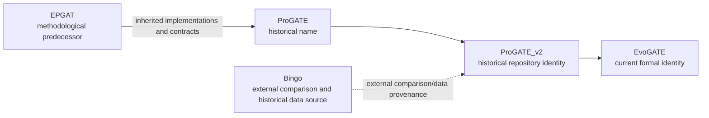

# EvoGATE project history

_Identity lineage and the boundary between inherited, historical, and current components._

---

## Project lineage

## EPGAT

EPGAT is a methodological predecessor and source of inherited legacy implementations, including GAT-centered code, later graph-model variants, feature contracts, and historical data conventions. EvoGATE retains adapters and compatible model classes to support controlled comparison and replay.

EPGAT is not an earlier spelling of EvoGATE and must not be presented as an EvoGATE package or module. Files under `docs/epgat_migration/` document this external-to-current migration history.

Status: **Historical**.

## ProGATE

ProGATE was an early project identity used while expanding beyond the EPGAT code and data organization. It is a historical name. The current repository contains no reason to use ProGATE as a public current name.

Status: **Historical**.

## ProGATE_v2

ProGATE_v2 was the immediate former repository identity. During this phase, the project developed or consolidated:

- protocolized Fusarium label reconstruction
- frozen label and split contracts
- canonical identifier bridges
- multimodal ORT/EXP/SUB/ESM2 loading
- GraphSAGE-centered and multi-model benchmarks
- label-scarcity, graph-robustness, fusion, and interpretation workflows
- candidate-prioritization artifacts

Many internal docstrings, reports, configs, and wrappers still contain ProGATE_v2 paths. These are migration residues, not evidence that the current project has two names.

Status: **Historical identity with active migration residue**.

## EvoGATE

EvoGATE is the sole current formal name. Its credible present scope is an evolution-aware essential-gene prediction and prioritization framework. Its defining scientific contribution is evolution-aware label reconstruction, not a particular GNN architecture.

RNA target discovery, off-target filtering, and dsRNA design are planned future stages and are not part of the currently implemented identity claim.

Status: **Current**.

## Bingo relationship

Bingo is an external comparison method and a historical source for some processed standard-label strategies according to `data/manifests/essential_gene_dataset_manifest.tsv`. It is not an EvoGATE dependency in the architectural sense, not an internal module, and not an EvoGATE alias.

Historical Bingo inventories and comparisons under `data/audits/` should remain provenance records.

## Inherited code and newly developed components

| Category | Examples | Interpretation |
|---|---|---|
| Inherited or compatibility code | `src/models/epgat_original.py`, `epgat_gcn.py`, `epgat_gin.py`, `epgat_sage.py`, legacy adapters | Preserve for audit and controlled replay |
| Current label design | Fusarium bridge, source preparation, materialization, frozen protocol | Core EvoGATE contribution |
| Current multimodal design | ESM2 extraction/alignment, feature contracts, fusion variants | EvoGATE implementation |
| Historical data | EPGAT/Bingo inventories, oldlabel, label rebuild experiments | Provenance and comparison only |
| Current results | Frozen manifests and named Figure artifacts | Evidence with known reconstruction limitations |
| Future application | RNA targets and dsRNA design | Planned, not inherited or implemented |

## Naming policy

- Use EvoGATE for the current project, repository, framework, and future manuscript.
- Use ProGATE or ProGATE_v2 only when identifying historical names or paths.
- Use EPGAT only for the predecessor method, inherited code, environment history, or legacy replay.
- Use Bingo only for external comparison or source provenance.
- Do not rewrite old artifact contents solely to modernize names; provenance must remain intact.

