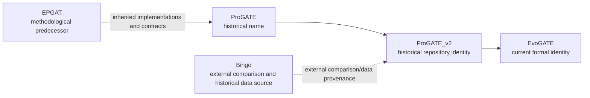

# EvoGATE 项目历史

_项目身份谱系，以及 inherited、historical 与 current component 的边界。_

---

## 项目谱系

## EPGAT

EPGAT 是方法学前身和遗留实现来源，包括以 GAT 为中心的代码、后续 graph-model variant、feature contract 和历史数据约定。EvoGATE 保留 adapter 与兼容 model class，以支持 controlled comparison 和 replay。

EPGAT 不是 EvoGATE 的早期拼写，也不得表述为 EvoGATE package 或 module。`docs/epgat_migration/` 记录从外部前身到当前项目的迁移历史。

状态：**Historical**。

## ProGATE

ProGATE 是项目从 EPGAT code/data organization 向外扩展期间使用的早期身份，属于历史名称。当前仓库没有理由将 ProGATE 作为公开的 current name。

状态：**Historical**。

## ProGATE_v2

ProGATE_v2 是当前仓库的直接前身身份。在此阶段，项目开发或整合了：

- Protocolized Fusarium label reconstruction
- Frozen label/split contract
- Canonical identifier bridge
- Multimodal ORT/EXP/SUB/ESM2 loading
- GraphSAGE-centered 与 multi-model benchmark
- Label-scarcity、graph-robustness、fusion 和 interpretation workflow
- Candidate-prioritization artifact

多个内部 docstring、report、config 和 wrapper 仍含 ProGATE_v2 path。这些是 migration residue，不表示当前项目存在两个名称。

状态：**Historical identity with active migration residue**。

## EvoGATE

EvoGATE 是唯一当前正式名称。其可信当前范围是 evolution-aware essential-gene prediction and prioritization framework。定义性科学贡献是 evolution-aware label reconstruction，而不是特定 GNN architecture。

RNA target discovery、off-target filtering 和 dsRNA design 是未来计划，不属于当前已实现的身份 claim。

状态：**Current**。

## 与 Bingo 的关系

根据 `data/manifests/essential_gene_dataset_manifest.tsv`，Bingo 是外部比较方法及部分 processed standard-label strategy 的历史来源。它不是架构意义上的 EvoGATE dependency，不是内部 module，也不是 EvoGATE 别名。

`data/audits/` 中的历史 Bingo inventory 与 comparison 应保留为 provenance record。

状态：**Historical**。

## Inherited code 与新开发组件

| 类别 | 示例 | 解释 |
|---|---|---|
| Inherited 或 compatibility code | `src/models/epgat_original.py`、`epgat_gcn.py`、`epgat_gin.py`、`epgat_sage.py`、legacy adapter | 保留用于 audit 和 controlled replay |
| Current label design | Fusarium bridge、source preparation、materialization、frozen protocol | EvoGATE 核心贡献 |
| Current multimodal design | ESM2 extraction/alignment、feature contract、fusion variant | EvoGATE 实现 |
| Historical data | EPGAT/Bingo inventory、oldlabel、label rebuild experiment | 仅用于 provenance 和 comparison |
| Current results | Frozen manifest 和命名 Figure artifact | 存在已知重建限制的证据 |
| Future application | RNA target 与 dsRNA design | Planned，非 inherited 或 implemented |

## 命名规范

- 当前项目、仓库、framework 和未来 manuscript 使用 EvoGATE。
- ProGATE/ProGATE_v2 仅用于标识历史名称或路径。
- EPGAT 仅用于 predecessor method、inherited code、environment history 或 legacy replay。
- Bingo 仅用于 external comparison 或 source provenance。
- 不得仅为更新名称而重写 old artifact 内容；必须保留 provenance。
